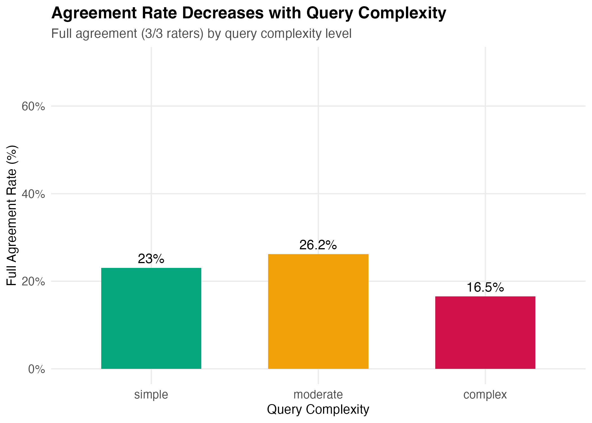
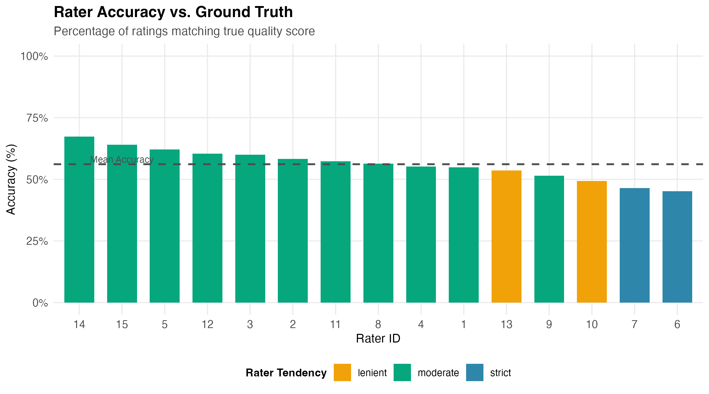

# Statistical Analysis of LLM Evaluation Quality Patterns

## Executive Summary

This project analyzes inter-rater reliability and accuracy patterns in large-scale LLM evaluation systems using synthetically generated data that mirrors real-world annotation workflows. Through statistical analysis of 1,000 evaluations across 15 raters, I discovered an unexpected pattern: **moderate complexity queries achieved 26.2% full rater agreement compared to only 23.0% for simple queries and 16.5% for complex queries** — defying conventional assumptions that simpler evaluations are easier to assess consistently.

The analysis revealed fair overall agreement (Fleiss' Kappa = 0.281) with 23% perfect agreement across all three raters per evaluation. Disagreement patterns showed strong domain and complexity effects, with opinion queries and complex evaluations presenting the greatest challenges for rater consistency.

**Key Technical Achievement:** Complete reproducible analytical pipeline from synthetic data generation through statistical analysis (Fleiss' Kappa, pairwise agreement, disagreement magnitude) and publication-quality reporting, showcasing practical application of inter-rater reliability methods to real-world evaluation quality challenges.

## Project Overview

This project demonstrates a comprehensive approach to analyzing quality and consistency in large-scale language model evaluation systems. Using synthetic data that mirrors real-world evaluation patterns, I built an end-to-end analytical pipeline to assess rater reliability, accuracy trends, and systematic evaluation patterns.

## Business Context

Large language model evaluation relies on human raters to assess response quality, accuracy, and appropriateness.

Understanding evaluation quality requires analyzing:

-   **Inter-rater reliability**: Do raters agree on quality assessments?
-   **Accuracy patterns**: How do rater judgments compare to ground truth?
-   **Systematic biases**: Are certain evaluation types more prone to disagreement?
-   **Quality drivers**: What factors predict evaluation difficulty?

## Technical Approach

### Data Generation

Created synthetic evaluation dataset (1,000 evaluations, 15 raters) with realistic patterns:

-   Multiple raters per evaluation (mimicking real annotation workflows)
-   Varying evaluation characteristics (complexity, domain, response length)
-   Ground truth labels with realistic rater noise
-   Systematic disagreement patterns based on evaluation difficulty

### Analysis Pipeline

1.  **Data Generation**: Synthetic dataset creation with realistic evaluation patterns
2.  **Exploratory Analysis**: Initial pattern discovery and data validation
3.  **Inter-Rater Reliability**: Statistical agreement metrics (Fleiss' Kappa, Cohen's Kappa)
4.  **Accuracy Analysis**: Performance metrics and systematic bias detection
5.  **Visualization**: Publication-quality plots for stakeholder communication

### Technologies Used

-   **R** (tidyverse, ggplot2, irr)
-   **Statistical Methods**: Inter-rater reliability, correlation analysis, hypothesis testing
-   **Reproducible Research**: R Markdown for automated reporting

## Key Findings

### Overall Inter-Rater Reliability

The analysis of 1,000 evaluations across 15 raters revealed **fair overall agreement** (Fleiss' Kappa = 0.281):

-   Complete agreement (3/3 raters): 23%

-   Partial agreement (2/3 raters): 82%

### Agreement Varies by Evaluation Type

**Domain Effects:**

-   Factual queries: 24.8% agreement (highest)
-   Opinion queries: 19.7% agreement (lowest)
-   Difference suggests domain-specific difficulty

**Complexity Effects:**

-   Simple queries: 23.0% agreement
-   Complex queries: 16.5% agreement
-   28% relative decrease in agreement for complex evaluations

**Key Discovery:**

Moderate complexity queries achieved higher agreement than simple queries, defying conventional assumptions about evaluation difficulty.

**Agreement Rates:**

-   Simple: 23.0%
-   **Moderate: 26.2%** ← Highest!
-   Complex: 16.5%

**Possible Explanations:**

1.  **Evaluation Guidelines Sweet Spot:** Guidelines may be optimized for moderate complexity, providing clear frameworks without overwhelming detail

2.  **Rater Engagement:** Simple queries may receive rushed evaluation while complex queries cause decision paralysis; moderate complexity maintains optimal rater attention

3.  **Criteria Clarity:** Very simple evaluations lack structure for systematic assessment, leading to subjective interpretations

**Business Implication:** Current training and guidelines are most effective for moderate complexity. Investment needed in frameworks for both simple (clear criteria setting) and complex (structured decomposition) evaluations.

### Individual Rater Performance

**Overall Accuracy Against Ground Truth:**

-   **Exact match accuracy:** 56.1%
-   **Within ±1 point:** 93.8% (raters rarely make extreme errors—e.g., rating quality-5 as quality-1)
-   **Accuracy range:** 45.1% to 67.4% (22.3 percentage point spread)

**Top 5 Most Accurate Raters:**

| Rater    | Accuracy | Tendency | Expertise | Consistency\* |
|----------|----------|----------|-----------|---------------|
| Rater 14 | 67.4%    | Moderate | General   | 0.935         |
| Rater 15 | 64.0%    | Moderate | General   | 0.893         |
| Rater 5  | 62.1%    | Moderate | Technical | 0.827         |
| Rater 12 | 60.4%    | Moderate | Technical | 0.802         |
| Rater 3  | 60.0%    | Moderate | General   | 0.730         |

*Consistency score: Simulation parameter (0.6-0.95) representing rater's reliability in applying evaluation criteria. Higher values indicate more consistent application of standards with less random variation.*

**Bottom 5 Least Accurate Raters:**

| Rater    | Accuracy | Tendency | Expertise | Consistency |
|----------|----------|----------|-----------|-------------|
| Rater 6  | 45.1%    | Strict   | Opinion   | 0.854       |
| Rater 7  | 46.4%    | Strict   | Technical | 0.608       |
| Rater 10 | 49.4%    | Lenient  | Creative  | 0.935       |
| Rater 9  | 51.5%    | Moderate | Factual   | 0.656       |
| Rater 13 | 53.6%    | Lenient  | Opinion   | 0.647       |

**Critical Pattern Discovered:**

All top 5 performers have **moderate rating tendency**, while 4 of bottom 5 have extreme tendencies (strict or lenient). This suggests that training raters to avoid extreme tendencies could improve accuracy by up to 22 percentage points.

**Accuracy by Rating Tendency:**

| Tendency     | Raters | Mean Accuracy | Std Dev |
|--------------|--------|---------------|---------|
| **Moderate** | 11     | **58.9%**     | 4.54%   |
| Lenient      | 2      | 51.5%         | 2.96%   |
| Strict       | 2      | 45.8%         | 0.92%   |

**Expertise Domain Matching Impact:**

Analysis of 3,000 individual ratings shows expertise alignment matters:

-   Ratings within rater's expertise domain: **58.0%** accuracy
-   Ratings outside rater's expertise domain: **54.5%** accuracy
-   **Strategic assignment benefit: +3.5 percentage points**

Example: Technical domain experts rating technical queries vs. opinion queries

**Consistency-Accuracy Correlation:** Moderate positive correlation (r = 0.33) between rater consistency and accuracy, suggesting that reliable raters also tend to be more accurate.

### Individual Rater Consistency Patterns

**Most Consistent Raters (Highest Agreement with Peers):**

| Rater    | Average Agreement | Profile Characteristics                    |
|----------|-------------------|--------------------------------------------|
| Rater 11 | 54.1%             | Moderate tendency, General domain expert   |
| Rater 3  | 49.1%             | Moderate tendency, General domain expert   |
| Rater 12 | 46.7%             | Moderate tendency, Technical domain expert |

**Least Consistent Raters (Lowest Agreement with Peers):**

| Rater    | Average Agreement | Profile Characteristics                  |
|----------|-------------------|------------------------------------------|
| Rater 10 | 34.4%             | Lenient tendency, Creative domain expert |
| Rater 7  | 38.5%             | Strict tendency, Technical domain expert |
| Rater 9  | 39.3%             | Moderate tendency, Factual domain expert |

**Key Insight:** 19.7 percentage point spread between most and least consistent raters (54.1% vs 34.4%). All top 3 most consistent raters share moderate rating tendency, while the bottom 3 include both strict and lenient extremes, reinforcing the importance of moderate tendency for reliable evaluation.

### Accuracy Varies by Evaluation Characteristics

#### Domain Effects on Accuracy

| Domain        | Exact Accuracy | Within ±1 | Mean Absolute Error |
|---------------|----------------|-----------|---------------------|
| **Technical** | **58.6%**      | 93.9%     | 0.476               |
| **Factual**   | **57.9%**      | 96.3%     | 0.464               |
| Creative      | 56.1%          | 95.8%     | 0.482               |
| Opinion       | 49.8%          | 88.3%     | 0.638               |

**Key Finding:** Opinion domain shows 8.8 percentage point lower accuracy than technical domain (15% relative decrease). Opinion evaluations are both harder to agree on (lowest IRR) AND harder to assess accurately.

------------------------------------------------------------------------

#### Complexity Effects on Accuracy

| Complexity   | Exact Accuracy | Within ±1 | Mean Absolute Error |
|--------------|----------------|-----------|---------------------|
| **Moderate** | **60.8%**      | 96.4%     | 0.433               |
| Simple       | 56.2%          | 96.0%     | 0.479               |
| Complex      | 46.4%          | 86.4%     | 0.684               |

**Critical Insight:**

Moderate complexity shows BOTH highest agreement (26.2%) AND highest accuracy (60.8%), confirming it as the "sweet spot" for evaluation quality. Complex queries show 14.4 percentage point accuracy penalty and 10-point drop in within-tolerance performance.

------------------------------------------------------------------------

#### Response Length Impact

| Length | Exact Accuracy | Within ±1 | Sample Size |
|--------|----------------|-----------|-------------|
| Short  | 56.9%          | 93.7%     | 831         |
| Medium | 56.3%          | 93.2%     | 1,581       |
| Long   | 54.3%          | 95.6%     | 588         |

**Pattern:**

Minimal accuracy variation by response length (2.6 point range), suggesting length is not a primary difficulty driver.

### Systematic Bias Patterns

**Overall Bias:**

Mean error = +0.01 (essentially zero systematic bias across all raters)

**Bias by True Quality Level (Regression to Mean Pattern):**

| True Quality | Mean Rating | Mean Error | \% Overrated | \% Underrated |
|--------------|-------------|------------|--------------|---------------|
| 1 (lowest)   | 1.35        | +0.35      | 28.5%        | 0.0%          |
| 2            | 2.08        | +0.08      | 28.7%        | 27.2%         |
| 3 (middle)   | 3.00        | 0.00       | 28.3%        | 27.5%         |
| 4            | 3.95        | -0.05      | 29.2%        | 27.5%         |
| 5 (highest)  | 4.72        | -0.28      | 0.0%         | 24.2%         |

**Key Pattern:**

Systematic regression to the mean: - Quality 1 responses overrated by 0.35 points on average - Quality 5 responses underrated by 0.28 points on average - Quality 3 rated most accurately (zero bias)

**Interpretation:** Raters tend to avoid extreme ratings, compressing the quality scale toward the middle. This is a common evaluation bias requiring calibration training.

------------------------------------------------------------------------

**Raters with Significant Systematic Bias (\|error\| \> 0.3):**

| Rater    | Mean Error | Tendency | Accuracy | Pattern                 |
|----------|------------|----------|----------|-------------------------|
| Rater 6  | -0.47      | Strict   | 45.1%    | Consistent under-rating |
| Rater 13 | +0.41      | Lenient  | 53.6%    | Consistent over-rating  |
| Rater 10 | +0.36      | Lenient  | 49.4%    | Consistent over-rating  |
| Rater 7  | -0.33      | Strict   | 46.4%    | Consistent under-rating |

**Validation Note:** These detected biases align with raters' pre-assigned tendencies (strict/lenient), confirming the analysis successfully identifies systematic patterns.

**Business Impact:** These 4 raters (27% of workforce) show predictable directional bias. Scores could be computationally adjusted for bias, or raters could receive targeted calibration training.

## Key Visualizations

### Moderate Complexity Advantage



*Moderate complexity queries show highest agreement rates (26.2%), defying conventional assumptions that simpler = easier to evaluate consistently.*

------------------------------------------------------------------------

### Rater Performance Variation



*22.3 percentage point spread in accuracy (45.1% to 67.4%) demonstrates significant opportunity for targeted training and strategic assignment.*

------------------------------------------------------------------------

*Additional visualizations (rating distributions, domain effects, disagreement patterns) available in the `output/figures/` directory.*

### Actionable Recommendations

Based on comprehensive statistical analysis of 3,000 individual ratings across 1,000 evaluations:

#### 1. High-Priority Training Interventions

**Target Audience: All Raters (ROI: High)**

-   **Moderate Tendency Training:** Top 5 performers all show moderate tendency; bottom performers show extreme tendencies. Training to moderate strict/lenient biases could improve accuracy by up to 13 percentage points.

-   **Regression-to-Mean Awareness:** Calibration exercises focusing on extreme quality levels (1s and 5s) to reduce systematic compression toward middle ratings.

**Target Audience: Low Performers (4 raters showing \>0.3 bias)**

-   Individual coaching with bias-corrected feedback

-   Intensive calibration on cases where their bias is most pronounced

#### 2. Strategic Rater Assignment

**Expertise Matching (ROI: Medium)**

-   Current benefit: +3.5 percentage points accuracy when domain expertise aligns with query type
-   Opportunity: Strategic assignment system to maximize expertise matching
-   Implementation: Automated routing based on rater profile and query characteristics

**Workload Considerations**

-   Rater 10 handled 90 evaluations (highest volume) with 49.4% accuracy

-   Rater 14 handled fewer evaluations with 67.4% accuracy

-   Investigate whether high volume degrades performance

#### 3. Guideline & Framework Development

**Priority 1: Complex Opinion Queries**

-   Worst combination: 1.71 mean disagreement, 49.8% accuracy

-   Solution: Structured decomposition frameworks breaking opinion queries into objective sub-criteria

**Priority 2: Simple Query Criteria Clarity**

-   Paradox: Lower agreement than moderate despite simpler content

-   Solution: Explicit rubrics to prevent subjective philosophical disagreements

**Priority 3: Extreme Quality Calibration**

-   Quality 1: 28.5% overrated, only 71.5% rated correctly

-   Quality 5: 24.2% underrated, only 75.8% rated correctly

-   Solution: Anchor examples and discussion of boundary cases

#### 4. Quality Assurance & Monitoring

**Automated Flagging System:**

-   Flag for review: Opinion + Complex combinations (1.71 disagreement)

-   Secondary review: 3+ point disagreement (8% of evaluations)

-   Monitor: Raters with \<50% accuracy for monthly coaching

**Performance Dashboards:**

-   Track individual rater bias trends over time

-   Monitor domain-specific accuracy by rater

-   Alert on consistency drops (may indicate rater fatigue)

**Expected Impact:**

-   Training on moderate tendency: +5-10 percentage points accuracy

-   Expertise matching optimization: +3.5 percentage points

-   Bias correction (computational or training): +2-3 percentage points

    -   *Computational: Algorithmically adjusting scores from biased raters (e.g., add 0.47 to Rater 6's consistently low ratings)*
    -   *Training: Calibration exercises to reduce systematic over/under-rating tendencies*

-   **Combined potential improvement: 10-16 percentage points accuracy gain**

## Repository Structure

```         
portfolio-llm-eval-quality/
│
├── README.md                          # This file
├── data/
│   ├── production/                    # Frozen dataset for published analysis
│   │   ├── evaluations_long.csv            
│   │   ├── evaluations_wide.csv
│   │   ├── rater_profiles.csv
│   │   └── rater_summary.csv
│   └── synthetic_data_generator.r         # Synthetic dataset creation
│
├── analysis/
│   ├── exploratory_analysis.r      # Initial pattern discovery
│   ├── irr_analysis.r   # IRR statistical analysis
│   ├── accuracy_analysis.r         # Performance metrics
│   └── visualization_script.r            # Publication-quality plots
│
├── output/
│   ├── figures/                       # Generated visualizations
│   ├── accuracy_analysis_results.rds
│   ├── exploratory_analysis_results.rds
│   └── irr_analysis_results.rds
│
└── docs/
    └── methodology.md   # Detailed technical documentation (optional enhancement)
```

## Running the Analysis

### Using Pre-Generated Data (Recommended)

The repository includes frozen production data in `data/production/` that matches 
all findings in this README:
```r
# 1. Restore package dependencies (first time only)
renv::restore()

# 2. Run analysis pipeline with production data
source("analysis/exploratory_analysis.r")
source("analysis/inter_rater_reliability.r")
source("analysis/accuracy_analysis.r")
source("analysis/visualization_script.r")
```

**Note:** Using `renv` ensures exact package versions match the analysis environment.

### Generating New Data (Optional)

To generate new synthetic data and re-run the full pipeline:

``` r
# 1. Archive current production data
archive_name <- paste0("data/production_archive_", format(Sys.Date(), "%Y%m%d"))
dir.create(archive_name, showWarnings = FALSE)
file.copy("data/production/", archive_name, recursive = TRUE)

# 2. Generate new data
source("data/synthetic_data_generator.r")
# Note: Due to set.seed(42), this will generate identical data to production/
# Change seed value in generator script if you want different data

# 3. Copy new data to production
file.copy(list.files("data", pattern = "\\.csv$", full.names = TRUE), 
          "data/production/", overwrite = TRUE)

# 4. Re-run analysis (results will differ from this README)
source("analysis/exploratory_analysis.r")
source("analysis/irr_analysis.r")
source("analysis/accuracy_analysis.r")
source("analysis/visualization_script.r")
```

## Data Generation & Reproducibility

The synthetic data is generated using `data/synthetic_data_generator.r` with a fixed random seed (42), ensuring perfect reproducibility. The `/data/production` folder contains the frozen dataset used for all analyses in this project. 

To verify reproducibility:
1. Run `source("data/synthetic_data_generator.r")`
2. Compare output to `/data/production/*.csv` files
3. They should be identical

This separation allows analysis scripts to reference stable inputs while maintaining the ability to regenerate data for verification.

## Skills Demonstrated

-   **Statistical Analysis**: Inter-rater reliability metrics, hypothesis testing, correlation analysis
-   **Data Manipulation**: Complex data restructuring, aggregation, transformation
-   **Data Visualization**: Professional plots for technical and executive audiences
-   **Reproducible Research**: Documented, version-controlled analysis pipeline
-   **Domain Expertise**: LLM evaluation quality assessment
-   **Communication**: Translating technical findings to actionable insights

## Future Enhancements

-   Machine learning models to predict evaluation difficulty
-   Natural language processing of rater comments/feedback
-   Time-series analysis of rater performance trends
-   Interactive dashboard for quality monitoring

## About This Project

This portfolio project was developed to demonstrate data science capabilities in the context of large-scale evaluation systems. The synthetic data mimics realistic patterns observed in LLM evaluation workflows while maintaining complete independence from any proprietary systems.

## Contact

**Jonathan Gress-Wright**

-   LinkedIn: <https://www.linkedin.com/in/jonathan-gress-wright/>
-   GitHub: <https://github.com/jgresswright/>
-   Email: [gressmeister\@gmail.com](mailto:gressmeister@gmail.com){.email}

------------------------------------------------------------------------

*All data in this project is synthetically generated. No proprietary or confidential information is included.*
